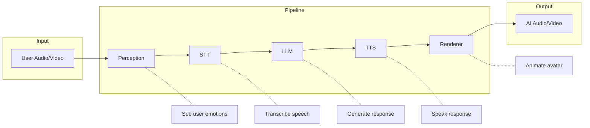

# Pipeline Configuration

The conversation pipeline processes audio and video through multiple stages. You can configure each stage when creating a conversation to customize the experience.

## Pipeline Overview



## Configuration Options

Configure the pipeline when creating a conversation:

```bash
POST /conversations
```

```json
{
  "personality_id": "luv_default",
  "conversation_name": "Support call",
  "pipeline": {
    "perception": {
      "enabled": true,
      "detect_emotions": true,
      "detect_gestures": true,
      "detect_objects": false
    },
    "stt": {
      "provider": "deepgram",
      "language": "en",
      "punctuate": true,
      "profanity_filter": false
    },
    "llm": {
      "provider": "anthropic",
      "model": "claude-sonnet-4-20250514",
      "temperature": 0.7,
      "max_tokens": 500
    },
    "tts": {
      "provider": "elevenlabs",
      "voice_id": "voice_abc123",
      "stability": 0.5,
      "similarity_boost": 0.8
    },
    "renderer": {
      "enabled": true,
      "quality": "high",
      "fps": 30
    }
  }
}
```

## Perception

The perception layer analyzes the user's video stream to understand visual context and emotional state. This information is passed to the LLM to enable more empathetic responses.

```json
{
  "perception": {
    "enabled": true,

    // Emotion detection
    "detect_emotions": true,     // happy, sad, confused, etc.

    // Gesture detection
    "detect_gestures": true,     // nodding, waving, thumbs up

    // Object detection
    "detect_objects": false,     // items in the scene

    // Ambient awareness
    "detect_environment": false  // lighting, background activity
  }
}
```

When perception is enabled, the LLM receives context like:

```
[User appears confused and is frowning slightly]
```

This allows the AI to say things like "You look a bit confused - would you like me to explain that differently?"

### Disabling Perception

For voice-only calls or privacy-sensitive applications:

```json
{
  "perception": {
    "enabled": false
  }
}
```

## Speech-to-Text (STT)

Configure how user speech is transcribed:

```json
{
  "stt": {
    // Provider selection
    "provider": "deepgram",       // "deepgram" | "whisper" | "azure"

    // Language
    "language": "en",             // ISO language code
    "detect_language": false,     // Auto-detect language

    // Processing options
    "punctuate": true,            // Add punctuation
    "profanity_filter": false,    // Censor profanity
    "diarize": false,             // Speaker identification

    // Advanced
    "model": "nova-2",            // Provider-specific model
    "keywords": ["Spike", "Luv"], // Boost recognition of specific words
    "interim_results": true       // Stream partial transcripts
  }
}
```

### Supported Languages

| Language | Code | Provider Support |
|----------|------|------------------|
| English | `en` | All |
| Spanish | `es` | All |
| French | `fr` | All |
| German | `de` | All |
| Japanese | `ja` | Deepgram, Whisper |
| Chinese | `zh` | Deepgram, Whisper |
| + 30 more | | |

## LLM

Configure the language model that generates responses:

```json
{
  "llm": {
    // Provider and model
    "provider": "anthropic",            // "anthropic" | "openai"
    "model": "claude-sonnet-4-20250514",  // Model identifier

    // Generation settings
    "temperature": 0.7,           // 0.0-1.0, higher = more creative
    "max_tokens": 500,            // Maximum response length
    "top_p": 0.9,                 // Nucleus sampling

    // Context management
    "max_context_turns": 20,      // Conversation history length
    "include_perception": true,   // Include visual context
    "include_memory": true,       // Include user memory

    // Safety
    "content_filter": true        // Filter harmful content
  }
}
```

The personality's system prompt is automatically included. The LLM receives:
1. System prompt (from personality)
2. User memories (if enabled)
3. Perception context (if enabled)
4. Conversation history
5. Current user message

## Text-to-Speech (TTS)

Configure how AI responses are spoken:

```json
{
  "tts": {
    // Provider and voice
    "provider": "elevenlabs",     // "elevenlabs" | "azure" | "cartesia"
    "voice_id": "voice_abc123",   // From personality or override

    // Voice characteristics
    "stability": 0.5,             // 0.0-1.0, lower = more expressive
    "similarity_boost": 0.8,      // 0.0-1.0, voice consistency
    "style": 0.5,                 // 0.0-1.0, speaking style intensity

    // Output settings
    "speed": 1.0,                 // 0.5-2.0, speaking rate
    "pitch": 0,                   // -20 to 20, pitch adjustment

    // Advanced
    "model": "eleven_turbo_v2",   // Provider-specific model
    "optimize_latency": true      // Prioritize speed over quality
  }
}
```

### Voice Selection

The voice is typically defined in the personality, but you can override per-conversation:

```json
{
  "personality_id": "luv_default",
  "pipeline": {
    "tts": {
      "voice_id": "different_voice_123"  // Override personality voice
    }
  }
}
```

## Renderer

Configure the AI avatar rendering:

```json
{
  "renderer": {
    "enabled": true,              // Enable video output

    // Quality settings
    "quality": "high",            // "low" | "medium" | "high"
    "fps": 30,                    // 15, 24, 30, or 60
    "resolution": "720p",         // "480p" | "720p" | "1080p"

    // Avatar behavior
    "idle_animation": true,       // Subtle movement when not speaking
    "lip_sync": true,             // Sync lips to speech
    "expressions": true,          // Show emotions
    "eye_contact": true,          // Look at camera

    // Background
    "background": "transparent",  // "transparent" | "blur" | URL
    "background_url": null        // Custom background image/video
  }
}
```

### Voice-Only Mode

Disable the renderer for voice-only conversations:

```json
{
  "renderer": {
    "enabled": false
  }
}
```

## Turn-Taking

Configure how the AI knows when to respond:

```json
{
  "turn_taking": {
    // Voice Activity Detection
    "vad_threshold": 0.5,         // Sensitivity to speech
    "silence_duration_ms": 700,   // Silence before AI responds

    // Interruption handling
    "allow_interruption": true,   // User can interrupt AI
    "interruption_threshold": 0.3, // How easily AI is interrupted

    // Smart turn detection
    "smart_endpointing": true,    // Use AI to detect turn completion
    "endpointing_model": "sparrow" // Turn detection model
  }
}
```

Smart endpointing uses an AI model to understand when the user has finished their thought, even if they pause mid-sentence.

## Presets

Use presets for common configurations:

```json
{
  "personality_id": "luv_default",
  "pipeline_preset": "low_latency"
}
```

| Preset | Description |
|--------|-------------|
| `default` | Balanced quality and latency |
| `low_latency` | Fastest responses, slightly reduced quality |
| `high_quality` | Best quality, higher latency |
| `voice_only` | No video rendering |
| `minimal` | No perception, basic STT/TTS |

## Latency Optimization

Typical end-to-end latency breakdown:

| Stage | Typical Latency |
|-------|-----------------|
| Audio capture | 20ms |
| STT | 100-200ms |
| LLM (first token) | 200-400ms |
| TTS (first audio) | 100-200ms |
| Rendering | 30-50ms |
| Network | 20-50ms |
| **Total** | **500-900ms** |

To minimize latency:

```json
{
  "pipeline": {
    "stt": {
      "provider": "deepgram",
      "model": "nova-2"           // Fastest model
    },
    "llm": {
      "provider": "anthropic",
      "model": "claude-sonnet-4-20250514", // Fast, high quality
      "max_tokens": 200           // Shorter responses
    },
    "tts": {
      "provider": "cartesia",     // Low-latency provider
      "optimize_latency": true
    },
    "renderer": {
      "quality": "medium",
      "fps": 24
    }
  }
}
```

## Runtime Updates

Some pipeline settings can be updated during a conversation:

```bash
PATCH /conversations/:id/pipeline
```

```json
{
  "llm": {
    "temperature": 0.9
  },
  "tts": {
    "speed": 1.2
  }
}
```

Updatable settings:
- LLM temperature, max_tokens
- TTS speed, pitch, stability
- Turn-taking thresholds

Not updatable (require new conversation):
- Providers
- Perception enable/disable
- Renderer enable/disable
