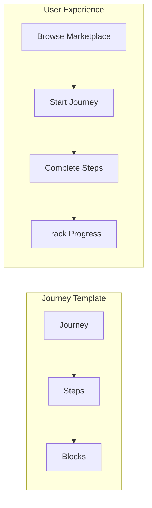
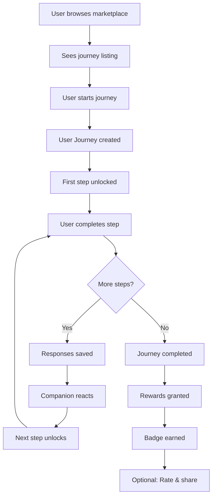

# Journeys

Guided Journeys are structured, multi-day experiences that help users grow alongside their AI companion—from building new habits and processing emotions to learning skills and having fun. Each journey combines personalized conversations, interactive exercises, and progress tracking to transform casual chats into meaningful, goal-oriented adventures.

## How Journeys Work



## Core Concepts

| Concept | Description |
|---------|-------------|
| **Journey** | The template/definition containing metadata, pricing, and configuration |
| **Step** | A single unit of interaction within a journey (e.g., "Day 1", "Week 2 Reflection") |
| **Block** | The atomic content/interaction unit within a step (messages, inputs, timers, etc.) |
| **User Journey** | A user's enrollment instance with their progress, streak, and responses |
| **User Step** | Progress on an individual step including status and responses |
| **Deliverable** | User-created content saved from deliverable steps (writings, recordings, etc.) |

## Journey Lifecycle



1. **Browse** — User discovers journeys in the marketplace
2. **Enroll** — User starts a journey, creating a `UserJourney` record
3. **Progress** — User completes steps, receives companion reactions, unlocks next steps
4. **Complete** — User finishes all steps, earns rewards and badges
5. **Share** — User optionally rates the journey and shares deliverables

## Two API Surfaces

Journeys are managed through two distinct API surfaces:

### Content API (Admin)

The Content API (`/journeys/*`) is for creating and managing journey templates:

- Create, update, and delete journey definitions
- Define steps and blocks within journeys
- Configure reaction templates
- Publish/unpublish journeys to the marketplace

```bash
POST /journeys
GET /journeys/{journey_id}
POST /journeys/{journey_id}/steps
POST /journeys/{journey_id}/steps/{step_id}/blocks
```

### User API (Consumer)

The User API (`/user/journeys/*`, `/marketplace/*`) is for user enrollment and progress:

- Browse available journeys in the marketplace
- Start and manage journey enrollments
- Complete steps and submit responses
- Track streaks, progress, and deliverables

```bash
GET /marketplace/journeys
POST /user/journeys/start
POST /user/journeys/{user_journey_id}/steps/{user_step_id}/complete
GET /user/deliverables
```

## Quick Start

### 1. Browse Available Journeys

```bash
GET /marketplace/journeys?category=emotional&sort=popular
```

```json
{
  "data": [
    {
      "id": "jrn_abc123",
      "title": "30 Days of Gratitude",
      "tagline": "Transform your mindset one day at a time",
      "category": "emotional",
      "duration_display": "30 days",
      "price_type": "free",
      "avg_rating": 4.8,
      "completion_count": 1247
    }
  ],
  "has_more": true,
  "next_cursor": "cursor_xyz"
}
```

### 2. Start a Journey

```bash
POST /user/journeys/start
```

```json
{
  "journey_id": "jrn_abc123"
}
```

```json
{
  "user_journey": {
    "id": "ujrn_def456",
    "journey_id": "jrn_abc123",
    "status": "active",
    "current_step_position": 1,
    "current_streak": 0
  },
  "first_step": {
    "id": "ustp_ghi789",
    "title": "Welcome to Gratitude",
    "blocks": [...]
  }
}
```

### 3. Complete a Step

```bash
POST /user/journeys/ujrn_def456/steps/ustp_ghi789/complete
```

```json
{
  "responses": [
    {
      "block_id": "blk_text1",
      "value": {
        "text": "I'm grateful for the morning sunshine...",
        "word_count": 47
      }
    }
  ]
}
```

```json
{
  "step_completed": true,
  "companion_reaction": {
    "message": "What a beautiful reflection! I love how you noticed the small details...",
    "mode": "validating"
  },
  "streak_update": {
    "previous_streak": 0,
    "current_streak": 1,
    "is_new_record": true
  },
  "next_step": {
    "id": "ustp_jkl012",
    "title": "Finding Joy in the Ordinary",
    "available_at": "2024-01-16T09:00:00Z"
  }
}
```

## Next Steps

<CardGroup cols={2}>
  <Card title="Supported Journeys" icon="compass" href="/developers/journeys/supported">
    Explore journey categories and companion roles
  </Card>
  <Card title="Journey Configuration" icon="gear" href="/developers/journeys/configuration">
    Learn how to structure steps and blocks
  </Card>
  <Card title="Journey Tracking" icon="chart-line" href="/developers/journeys/tracking">
    Understand progress, streaks, and analytics
  </Card>
  <Card title="API Reference" icon="code" href="/api-reference">
    Full API documentation for Journeys
  </Card>
</CardGroup>
