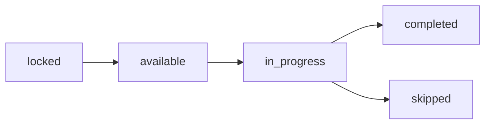
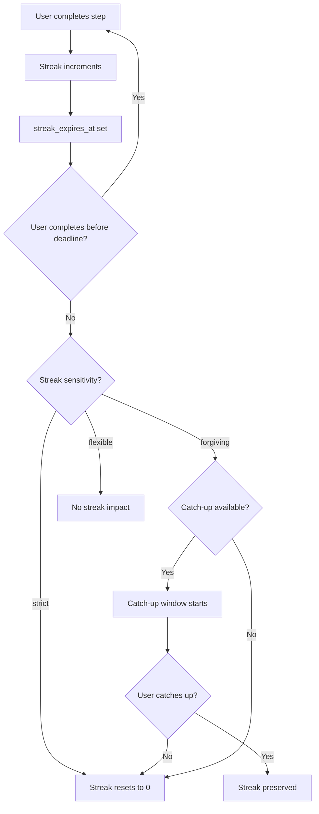

# Journey Tracking

Track user progress through journeys, manage streaks, store responses, and analyze completion data.

## User Journey State

When a user starts a journey, a `UserJourney` record tracks their progress:

```typescript
{
  id: string;                    // ujrn_xxxxx
  user_id: string;               // The user
  journey_id: string;            // The journey template
  status: UserJourneyStatus;     // active, paused, completed, abandoned
  current_step_position: number; // Current position in journey
  completed_steps_count: number; // Steps completed so far
  total_steps: number;           // Total steps in journey
  progress: number;              // Completion percentage (0-100)
  current_streak: number;        // Current consecutive days
  longest_streak: number;        // Best streak achieved
  catch_ups_remaining?: number;  // Remaining catch-up opportunities
  catch_ups_used: number;        // Catch-ups consumed
  last_activity_at?: Date;       // Last step completion
  streak_expires_at?: Date;      // When current streak will break
  next_step_available_at?: Date; // When next step unlocks
  started_at: Date;              // Journey start time
  completed_at?: Date;           // Journey completion time
  user_rating?: number;          // User's rating (1-5)
}
```

### Fetching User Journeys

```bash
GET /user/journeys?status=active
```

```json
{
  "data": [
    {
      "id": "ujrn_abc123",
      "journey_id": "jrn_xyz",
      "status": "active",
      "current_step_position": 5,
      "completed_steps_count": 4,
      "total_steps": 30,
      "progress": 13.3,
      "current_streak": 4,
      "longest_streak": 4,
      "streak_expires_at": "2024-01-16T23:59:59Z",
      "journey": {
        "title": "30 Days of Gratitude",
        "category": "emotional"
      }
    }
  ],
  "has_more": false
}
```

### Active Journeys with Current Step

```bash
GET /user/journeys/active
```

```json
{
  "data": [
    {
      "id": "ujrn_abc123",
      "status": "active",
      "current_streak": 4,
      "streak_status": "safe",
      "hours_until_streak_expires": 18,
      "current_step": {
        "id": "ustp_def456",
        "title": "Finding Joy in the Ordinary",
        "status": "available"
      }
    }
  ]
}
```

## User Step State

Each step has its own progress record:

```typescript
{
  id: string;                    // ustp_xxxxx
  user_journey_id: string;       // Parent user journey
  step_id: string;               // The step template
  status: UserStepStatus;        // locked, available, in_progress, completed, skipped
  unlocked_at?: Date;            // When step became available
  started_at?: Date;             // When user began the step
  completed_at?: Date;           // When user finished
  time_spent_seconds?: number;   // Time to complete
  companion_reaction?: string;   // AI response after completion
  instance_number: number;       // For repeating template steps
  instance_date?: Date;          // Date for this instance
}
```

### Step Status Flow



### Getting Current Step

```bash
GET /user/journeys/{user_journey_id}/current-step
```

```json
{
  "id": "ustp_def456",
  "step_id": "stp_abc",
  "position": 5,
  "day_number": 5,
  "title": "Finding Joy in the Ordinary",
  "is_milestone": false,
  "creates_deliverable": true,
  "completion_rule": "all_required",
  "blocks": [
    {
      "id": "blk_msg1",
      "block_type": "companion_message",
      "content": "Today we're looking for joy in unexpected places...",
      "is_required": false
    },
    {
      "id": "blk_input1",
      "block_type": "text_input",
      "content": "Describe something ordinary that brought you joy today.",
      "config": {
        "placeholder": "Start writing...",
        "min_length": 50
      },
      "is_required": true
    }
  ]
}
```

## Block Response Storage

Responses are stored with structure varying by block type:

### Response Formats by Block Type

```typescript
// text_input
{ text: "The door was painted red...", word_count: 127 }

// voice_input
{ audio_url: "https://...", duration_seconds: 45, transcription: "..." }

// single_select
{ selected_id: "option_1", selected_value: "gryffindor" }

// multi_select
{ selected_ids: ["theme_1", "theme_3"] }

// scale
{ value: 4 }

// binary
{ value: true }

// counter
{ value: 8, unit: "glasses" }

// timer
{ completed: true, actual_seconds: 1480, early_complete: false }

// checklist
{ checked_ids: ["item_1", "item_3"], custom_items: ["My custom item"] }

// media_upload
{ file_url: "https://...", file_type: "image/jpeg", file_size: 2048000 }

// external_confirm
{ confirmed: true, skipped: false }
```

### Submitting Step Responses

```bash
POST /user/journeys/{user_journey_id}/steps/{user_step_id}/complete
```

```json
{
  "responses": [
    {
      "block_id": "blk_input1",
      "value": {
        "text": "Today I noticed the way sunlight streamed through my kitchen window...",
        "word_count": 127
      },
      "metadata": {
        "input_method": "keyboard",
        "time_to_complete": 180
      }
    }
  ]
}
```

### Step Completion Response

```json
{
  "step_completed": true,
  "companion_reaction": {
    "message": "What a beautiful observation! I love how you noticed the play of light...",
    "mode": "validating"
  },
  "streak_update": {
    "previous_streak": 4,
    "current_streak": 5,
    "is_new_record": true
  },
  "rewards": {
    "gems_earned": 10,
    "coins_earned": 0,
    "badge_earned": null
  },
  "next_step": {
    "id": "ustp_ghi789",
    "title": "Gratitude in Motion",
    "available_at": "2024-01-16T09:00:00Z"
  },
  "journey_completed": false,
  "deliverable_created": {
    "id": "dlv_jkl012",
    "title": "Day 5: Finding Joy"
  }
}
```

## Streak Logic

Streaks track consecutive completions and are managed based on the journey's sensitivity setting:

### Streak Sensitivity Levels

| Sensitivity | Miss Behavior | Catch-up Available |
|-------------|---------------|---------------------|
| `strict` | Streak resets immediately | No |
| `forgiving` | Catch-up window (configurable days) | Yes |
| `flexible` | No streak pressure, pick up anytime | N/A |

### Streak Flow



### Using Catch-up

```bash
POST /user/journeys/{user_journey_id}/catch-up
```

```json
{
  "success": true,
  "catch_ups_remaining": 1,
  "streak_preserved": true,
  "current_streak": 5
}
```

## Journey Actions

### Pausing a Journey

```bash
POST /user/journeys/{user_journey_id}/pause
```

Pausing stops streak tracking and freezes progress:

```json
{
  "id": "ujrn_abc123",
  "status": "paused",
  "current_streak": 5,
  "streak_expires_at": null
}
```

### Resuming a Journey

```bash
POST /user/journeys/{user_journey_id}/resume
```

```json
{
  "user_journey": {
    "id": "ujrn_abc123",
    "status": "active"
  },
  "current_step": { ... },
  "streak_restored": true,
  "catch_up_required": false
}
```

### Abandoning a Journey

```bash
POST /user/journeys/{user_journey_id}/abandon
```

```json
{
  "id": "ujrn_abc123",
  "status": "abandoned"
}
```

Users can restart an abandoned journey by starting fresh.

### Rating a Completed Journey

```bash
POST /user/journeys/{user_journey_id}/rate
```

```json
{
  "rating": 5,
  "feedback": "This journey really helped me build a daily gratitude practice!"
}
```

## Deliverables

Steps marked with `creates_deliverable: true` save user content:

### Listing Deliverables

```bash
GET /user/deliverables?journey_id=jrn_abc
```

```json
{
  "data": [
    {
      "id": "dlv_abc123",
      "user_journey_id": "ujrn_xyz",
      "title": "Day 1: The Door",
      "content": "The door was painted red, peeling at the edges...",
      "content_type": "text",
      "is_public": false,
      "is_pinned": true,
      "created_at": "2024-01-15T14:30:00Z",
      "journey": {
        "id": "jrn_writing",
        "title": "30 Days of Creative Writing"
      },
      "step": {
        "day_number": 1,
        "title": "The Door"
      }
    }
  ],
  "has_more": true,
  "next_cursor": "cursor_xyz"
}
```

### Sharing Deliverables

```bash
POST /user/deliverables/{deliverable_id}/share
```

```json
{
  "share_url": "https://app.spikelabs.com/share/dlv_abc123",
  "expires_at": "2024-02-15T14:30:00Z"
}
```

### Updating Deliverable Settings

```bash
PATCH /user/deliverables/{deliverable_id}
```

```json
{
  "title": "My Door Story",
  "is_public": true,
  "is_pinned": true
}
```

## Analytics & Statistics

### User Journey Statistics

```bash
GET /user/journey-stats
```

```json
{
  "total_journeys_started": 8,
  "total_journeys_completed": 5,
  "total_steps_completed": 147,
  "total_deliverables_created": 42,
  "current_active_journeys": 2,
  "longest_streak_ever": 30,
  "total_time_spent_minutes": 2940,
  "categories_explored": ["emotional", "education", "habit"],
  "completion_rate": 62.5
}
```

### Journey Events

Track these events for analytics:

| Event | Description |
|-------|-------------|
| `journey_started` | User begins a journey |
| `journey_paused` | User pauses progress |
| `journey_resumed` | User resumes after pause |
| `journey_completed` | User finishes all steps |
| `journey_abandoned` | User quits the journey |
| `step_unlocked` | New step becomes available |
| `step_started` | User begins a step |
| `step_completed` | User finishes a step |
| `step_skipped` | User skips an optional step |
| `streak_incremented` | Streak count increases |
| `streak_broken` | Streak resets to zero |
| `catch_up_used` | User uses catch-up |
| `deliverable_created` | Content saved from step |
| `deliverable_shared` | User shares content |

## Best Practices

### Streak Design

- Use `forgiving` sensitivity for new users
- Offer 1-2 catch-up days for fixed journeys
- Use `flexible` for educational content where streaks aren't motivating
- Reserve `strict` for challenges where the pressure is part of the experience

### Step Pacing

- Daily journeys: Unlock steps at consistent times (e.g., 9 AM user's timezone)
- Use `available_after_hours` to prevent binge-completing
- Mark meaningful checkpoints as milestones for extra celebration

### Response Collection

- Keep required blocks minimal for daily habits
- Use `any_input` completion rule for quick check-ins
- Save deliverables for meaningful creative output, not every response

### Progress Visibility

- Show users their streak prominently
- Celebrate milestones with special reactions
- Display completion percentage to motivate continued progress
