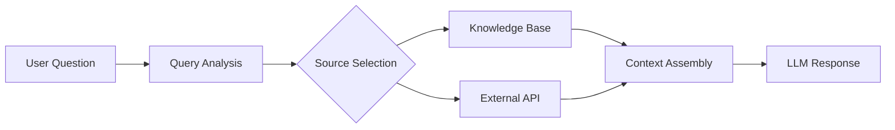

# External Sources

Connect external data sources to your knowledge base for real-time information retrieval. External sources are queried at conversation time, ensuring your AI always has access to the latest data.

## How External Sources Work



Unlike documents and URLs which are indexed ahead of time, external sources are queried in real-time during conversations.

## Supported Source Types

| Type | Description | Use Case |
|------|-------------|----------|
| REST API | Query any REST endpoint | Internal databases, CRM, custom APIs |
| GraphQL | Query GraphQL endpoints | Complex data relationships |
| Database | Direct database queries | Real-time inventory, user data |
| Webhook | Your server is called | Custom logic, authentication |

## Add a REST API Source

```bash
POST /personalities/:personality_id/knowledge/external
```

```json
{
  "name": "Product Inventory",
  "type": "rest",
  "config": {
    "base_url": "https://api.example.com",
    "endpoints": [
      {
        "name": "get_product",
        "method": "GET",
        "path": "/products/{product_id}",
        "description": "Get product details by ID"
      },
      {
        "name": "search_products",
        "method": "GET",
        "path": "/products/search",
        "params": ["query", "category"],
        "description": "Search products by name or category"
      }
    ],
    "authentication": {
      "type": "header",
      "header": "X-API-Key",
      "value": "{{API_KEY}}"
    }
  },
  "secrets": {
    "API_KEY": "your-api-key-here"
  }
}
```

```json
{
  "source_id": "src_abc123",
  "name": "Product Inventory",
  "type": "rest",
  "status": "active",
  "created_at": "2024-01-15T10:30:00Z"
}
```

## Add a Database Source

Connect directly to a database:

```bash
POST /personalities/:personality_id/knowledge/external
```

```json
{
  "name": "Customer Database",
  "type": "database",
  "config": {
    "driver": "postgresql",
    "host": "db.example.com",
    "port": 5432,
    "database": "customers",
    "queries": [
      {
        "name": "get_customer",
        "description": "Get customer by email",
        "sql": "SELECT name, plan, created_at FROM customers WHERE email = :email",
        "params": ["email"]
      },
      {
        "name": "get_recent_orders",
        "description": "Get customer's recent orders",
        "sql": "SELECT * FROM orders WHERE customer_id = :customer_id ORDER BY created_at DESC LIMIT 10",
        "params": ["customer_id"]
      }
    ]
  },
  "secrets": {
    "DB_USER": "readonly_user",
    "DB_PASSWORD": "your-password"
  }
}
```

Supported databases: `postgresql`, `mysql`, `mongodb`

## Add a Webhook Source

Your server handles the query:

```bash
POST /personalities/:personality_id/knowledge/external
```

```json
{
  "name": "Custom Search",
  "type": "webhook",
  "config": {
    "url": "https://your-server.com/ai-search",
    "method": "POST",
    "description": "Search internal knowledge and return relevant results",
    "authentication": {
      "type": "bearer",
      "token": "{{WEBHOOK_TOKEN}}"
    }
  },
  "secrets": {
    "WEBHOOK_TOKEN": "your-webhook-token"
  }
}
```

When triggered, Spike sends:

```json
{
  "query": "What's the status of order #12345?",
  "context": {
    "conversation_id": "conv_xyz",
    "user_id": "user_abc",
    "personality_id": "personality_xyz"
  }
}
```

Your server responds:

```json
{
  "results": [
    {
      "content": "Order #12345 was shipped on Jan 15 and is scheduled for delivery on Jan 18.",
      "metadata": {
        "source": "order_system",
        "order_id": "12345"
      }
    }
  ]
}
```

## Query Routing

Configure when to query each source:

```bash
PATCH /personalities/:personality_id/knowledge/external/:source_id
```

```json
{
  "routing": {
    "keywords": ["order", "shipping", "delivery", "tracking"],
    "intent_patterns": ["check order status", "track package"],
    "always_query": false
  }
}
```

| Setting | Description |
|---------|-------------|
| `keywords` | Query when these words appear |
| `intent_patterns` | Query when user intent matches |
| `always_query` | Query on every message |

## List External Sources

```bash
GET /personalities/:personality_id/knowledge/external
```

```json
{
  "sources": [
    {
      "source_id": "src_abc123",
      "name": "Product Inventory",
      "type": "rest",
      "status": "active",
      "stats": {
        "queries_today": 145,
        "avg_latency_ms": 89,
        "error_rate": 0.01
      }
    }
  ]
}
```

## Test a Source

Test your source configuration:

```bash
POST /personalities/:personality_id/knowledge/external/:source_id/test
```

```json
{
  "query": "What products do you have in the electronics category?"
}
```

```json
{
  "success": true,
  "latency_ms": 127,
  "results": [
    {
      "content": "Found 15 products in electronics...",
      "metadata": {}
    }
  ]
}
```

## Update Source Configuration

```bash
PATCH /personalities/:personality_id/knowledge/external/:source_id
```

```json
{
  "config": {
    "endpoints": [
      {
        "name": "get_product",
        "method": "GET",
        "path": "/v2/products/{product_id}"
      }
    ]
  }
}
```

## Rotate Secrets

Update API keys or passwords:

```bash
POST /personalities/:personality_id/knowledge/external/:source_id/secrets
```

```json
{
  "secrets": {
    "API_KEY": "new-api-key"
  }
}
```

## Disable/Enable a Source

```bash
POST /personalities/:personality_id/knowledge/external/:source_id/disable
```

```bash
POST /personalities/:personality_id/knowledge/external/:source_id/enable
```

## Delete a Source

```bash
DELETE /personalities/:personality_id/knowledge/external/:source_id
```

## Error Handling

Configure behavior when external sources fail:

```json
{
  "error_handling": {
    "timeout_ms": 5000,
    "retry_count": 2,
    "fallback": "continue",
    "notify_on_failure": true
  }
}
```

| Setting | Description |
|---------|-------------|
| `timeout_ms` | Maximum wait time |
| `retry_count` | Number of retries on failure |
| `fallback` | `"continue"` (skip source) or `"error"` (fail conversation) |
| `notify_on_failure` | Send webhook on repeated failures |

## Security Best Practices

1. **Use read-only credentials** - External sources should never modify data
2. **Limit query scope** - Only expose necessary data
3. **Rotate secrets regularly** - Update API keys periodically
4. **Monitor usage** - Watch for unusual query patterns
5. **Use IP allowlisting** - Restrict access to Spike's IP ranges
