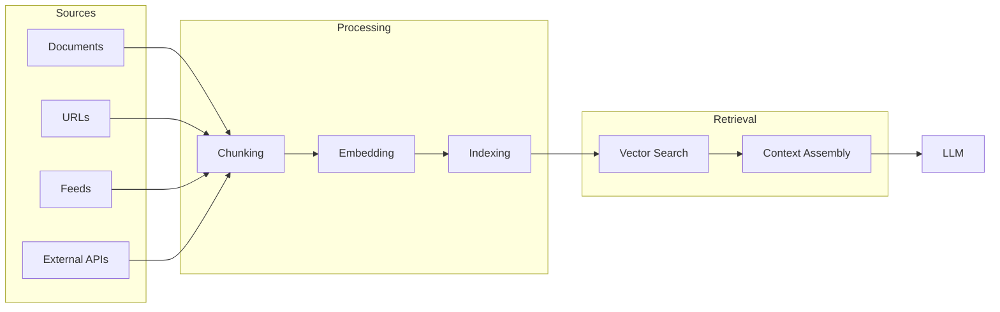

# Knowledge Base

The Knowledge Base allows you to provide your AI personality with custom information beyond its training data. This enables domain-specific expertise, product knowledge, company policies, and any other information your AI needs to be helpful.

## How It Works



When a user asks a question, the system:
1. Searches the knowledge base for relevant information
2. Retrieves the most relevant chunks
3. Includes them in the LLM context
4. Generates a response grounded in your data

## Knowledge Base vs Memories

| Aspect | Knowledge Base | User Memories |
|--------|---------------|---------------|
| **Scope** | Per personality | Per user-personality pair |
| **Content** | Documents, URLs, structured data | Personal facts, preferences, history |
| **Source** | Uploaded by developer | Learned from conversations |
| **Shared** | Same for all users | Unique to each user |

**Example:**
- Knowledge Base: "Our return policy is 30 days with receipt"
- Memory: "Sarah prefers email over phone calls"

## Creating a Knowledge Base

Each personality can have one knowledge base:

```bash
POST /personalities/:personality_id/knowledge
```

```json
{
  "name": "Product Support Knowledge",
  "description": "Product documentation and support articles",
  "settings": {
    "chunk_size": 512,
    "chunk_overlap": 50,
    "embedding_model": "text-embedding-3-small"
  }
}
```

```json
{
  "knowledge_id": "kb_abc123",
  "personality_id": "personality_xyz",
  "name": "Product Support Knowledge",
  "description": "Product documentation and support articles",
  "settings": {
    "chunk_size": 512,
    "chunk_overlap": 50,
    "embedding_model": "text-embedding-3-small"
  },
  "stats": {
    "document_count": 0,
    "chunk_count": 0,
    "last_updated": null
  },
  "created_at": "2024-01-15T10:30:00Z"
}
```

## Retrieval Settings

Configure how knowledge is retrieved during conversations:

```bash
PATCH /personalities/:personality_id/knowledge
```

```json
{
  "retrieval": {
    "enabled": true,
    "max_chunks": 5,
    "min_relevance": 0.7,
    "include_sources": true
  }
}
```

| Setting | Description | Default |
|---------|-------------|---------|
| `enabled` | Whether to search knowledge base | `true` |
| `max_chunks` | Maximum chunks to include | `5` |
| `min_relevance` | Minimum similarity score (0-1) | `0.7` |
| `include_sources` | Include source attribution | `true` |

## Viewing Knowledge Base Status

```bash
GET /personalities/:personality_id/knowledge
```

```json
{
  "knowledge_id": "kb_abc123",
  "personality_id": "personality_xyz",
  "name": "Product Support Knowledge",
  "stats": {
    "document_count": 45,
    "url_count": 12,
    "feed_count": 2,
    "chunk_count": 1847,
    "total_tokens": 523000,
    "last_updated": "2024-01-20T14:22:00Z"
  },
  "sources": {
    "documents": 45,
    "urls": 12,
    "feeds": 2,
    "external": 1
  }
}
```

## Deleting a Knowledge Base

```bash
DELETE /personalities/:personality_id/knowledge
```

This removes all documents, URLs, and indexed content. This action cannot be undone.

## Best Practices

### Content Quality
- Use clear, well-structured content
- Remove duplicate information
- Keep content up to date
- Include context in documents (don't assume prior knowledge)

### Chunking Strategy
- Smaller chunks (256-512 tokens) for factual Q&A
- Larger chunks (512-1024 tokens) for complex explanations
- Increase overlap for content with important context

### Organization
- Group related content in the same documents
- Use descriptive titles and metadata
- Tag content for filtering

### Testing
- Test retrieval with sample questions
- Check that relevant content is being found
- Adjust relevance thresholds as needed
