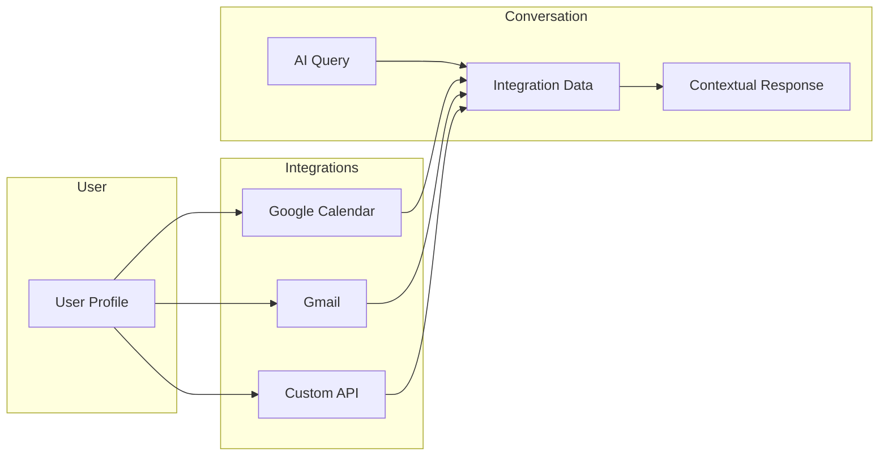

# Integrations

Integrations connect external services to a user's profile, allowing the AI to access relevant data like calendars, emails, and custom APIs. This enables contextual responses based on real-time information.

## How Integrations Work



During conversations, the AI can query connected integrations to provide contextual responses:
- "What's on my calendar today?" → Queries Google Calendar
- "Did I get any emails from Sarah?" → Queries Gmail
- "What's my order status?" → Queries custom API

## Available Integrations

| Integration | Description | Data Access |
|-------------|-------------|-------------|
| Google Calendar | Calendar events | Read events, create events |
| Gmail | Email messages | Read emails, search |
| Microsoft 365 | Calendar & email | Read events, emails |
| Notion | Notes & databases | Read pages, query databases |
| Linear | Issue tracking | Read issues, projects |
| Custom Webhook | Your own APIs | Whatever you expose |

## List User Integrations

```bash
GET /users/:user_id/integrations
```

```json
{
  "integrations": [
    {
      "integration_id": "int_abc123",
      "provider": "google_calendar",
      "status": "connected",
      "scopes": ["calendar.readonly", "calendar.events"],
      "connected_at": "2024-01-15T10:30:00Z",
      "last_used_at": "2024-01-20T14:22:00Z"
    },
    {
      "integration_id": "int_def456",
      "provider": "gmail",
      "status": "connected",
      "scopes": ["gmail.readonly"],
      "connected_at": "2024-01-15T10:32:00Z"
    }
  ]
}
```

## Connect an Integration

### OAuth Integrations

For OAuth-based integrations (Google, Microsoft, etc.), initiate the connection flow:

```bash
POST /users/:user_id/integrations/connect
```

```json
{
  "provider": "google_calendar",
  "scopes": ["calendar.readonly", "calendar.events"],
  "redirect_url": "https://your-app.com/callback"
}
```

```json
{
  "authorization_url": "https://accounts.google.com/oauth/authorize?...",
  "state": "abc123xyz"
}
```

Redirect the user to `authorization_url`. After they authorize, they'll be redirected to your `redirect_url` with an authorization code.

### Complete OAuth Connection

```bash
POST /users/:user_id/integrations/callback
```

```json
{
  "provider": "google_calendar",
  "code": "authorization_code_from_callback",
  "state": "abc123xyz"
}
```

```json
{
  "integration_id": "int_abc123",
  "provider": "google_calendar",
  "status": "connected",
  "scopes": ["calendar.readonly", "calendar.events"]
}
```

### Webhook Integration

For custom integrations, configure a webhook:

```bash
POST /users/:user_id/integrations
```

```json
{
  "provider": "custom_webhook",
  "name": "Order System",
  "config": {
    "url": "https://your-api.com/ai-query",
    "authentication": {
      "type": "bearer",
      "token": "{{USER_API_TOKEN}}"
    },
    "capabilities": [
      {
        "name": "get_orders",
        "description": "Get user's recent orders",
        "trigger_phrases": ["order", "purchase", "bought"]
      },
      {
        "name": "get_order_status",
        "description": "Check status of a specific order",
        "trigger_phrases": ["order status", "where is my order", "tracking"]
      }
    ]
  },
  "secrets": {
    "USER_API_TOKEN": "user-specific-token"
  }
}
```

## Get Integration Details

```bash
GET /users/:user_id/integrations/:integration_id
```

```json
{
  "integration_id": "int_abc123",
  "provider": "google_calendar",
  "status": "connected",
  "scopes": ["calendar.readonly", "calendar.events"],
  "connected_at": "2024-01-15T10:30:00Z",
  "last_used_at": "2024-01-20T14:22:00Z",
  "stats": {
    "queries_today": 12,
    "queries_total": 347
  }
}
```

## Update Integration

Update integration settings:

```bash
PATCH /users/:user_id/integrations/:integration_id
```

```json
{
  "enabled": true,
  "config": {
    "default_calendar": "primary"
  }
}
```

## Disconnect Integration

```bash
DELETE /users/:user_id/integrations/:integration_id
```

This revokes access and removes the integration. The user will need to reconnect to restore access.

## Integration Permissions

Control which personalities can access which integrations:

```bash
PATCH /users/:user_id/integrations/:integration_id
```

```json
{
  "personality_access": {
    "personality_xyz": true,
    "personality_abc": false
  }
}
```

By default, all personalities for the user can access connected integrations.

## Using Integrations in Conversations

Enable integration access in the conversation pipeline:

```json
{
  "pipeline": {
    "llm": {
      "include_integrations": true,
      "integration_settings": {
        "allowed": ["google_calendar", "gmail"],
        "timeout_ms": 3000
      }
    }
  }
}
```

The AI will automatically query relevant integrations based on the conversation context.

## Query an Integration Directly

Test integration queries outside of a conversation:

```bash
POST /users/:user_id/integrations/:integration_id/query
```

```json
{
  "query": "What meetings do I have tomorrow?"
}
```

```json
{
  "results": [
    {
      "title": "Team Standup",
      "start": "2024-01-21T09:00:00Z",
      "end": "2024-01-21T09:30:00Z",
      "attendees": ["alice@example.com", "bob@example.com"]
    },
    {
      "title": "Product Review",
      "start": "2024-01-21T14:00:00Z",
      "end": "2024-01-21T15:00:00Z",
      "location": "Conference Room A"
    }
  ],
  "latency_ms": 234
}
```

## Refresh Integration Tokens

For OAuth integrations, tokens are refreshed automatically. To force a refresh:

```bash
POST /users/:user_id/integrations/:integration_id/refresh
```

## Integration Health

Check if integrations are working:

```bash
GET /users/:user_id/integrations/:integration_id/health
```

```json
{
  "integration_id": "int_abc123",
  "status": "healthy",
  "last_successful_query": "2024-01-20T14:22:00Z",
  "token_expires_at": "2024-02-15T10:30:00Z"
}
```

Status values:
- `healthy` - Working normally
- `degraded` - Experiencing issues
- `disconnected` - Needs reconnection
- `expired` - Token expired, needs reauthorization

## Webhook Integration Details

When the AI queries your webhook integration, Spike sends:

```json
{
  "capability": "get_order_status",
  "query": "Where is my order from last week?",
  "user": {
    "user_id": "user_abc123",
    "external_id": "your-user-id"
  },
  "context": {
    "conversation_id": "conv_xyz",
    "personality_id": "personality_abc"
  }
}
```

Your server should respond:

```json
{
  "results": [
    {
      "content": "Your order #12345 (Blue Widget) shipped on Jan 18 and is out for delivery today.",
      "structured_data": {
        "order_id": "12345",
        "status": "out_for_delivery",
        "eta": "2024-01-20"
      }
    }
  ]
}
```

## Privacy & Security

### Data Minimization

Integrations only access data when queried during conversations. Spike does not store integration data - it's fetched in real-time and discarded after the conversation.

### User Consent

Users must explicitly authorize each integration. They can revoke access at any time through disconnection.

### Token Security

- OAuth tokens are encrypted at rest
- Refresh tokens are used to maintain access without re-authorization
- Tokens are scoped to minimum necessary permissions

### Audit Log

Track integration usage:

```bash
GET /users/:user_id/integrations/:integration_id/audit
```

```json
{
  "events": [
    {
      "event_type": "query",
      "conversation_id": "conv_xyz",
      "query": "What's on my calendar?",
      "timestamp": "2024-01-20T14:22:00Z"
    },
    {
      "event_type": "connected",
      "timestamp": "2024-01-15T10:30:00Z"
    }
  ]
}
```
