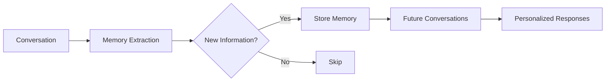

# Memories

Memories store personal information about each user that the AI learns during conversations. This enables personalized experiences across sessions.

## How Memories Work



During conversations, the AI automatically identifies and stores important personal information:
- Facts about the user ("I live in Seattle")
- Preferences ("I prefer email over phone calls")
- Important dates ("My anniversary is June 15th")
- Context ("I'm working on a React project")

## Memory Scoping

Memories are scoped per user-personality pair:

```
User: Sarah
├── Personality: Customer Support
│   └── Memories: order preferences, support history
├── Personality: Personal Assistant
│   └── Memories: schedule preferences, reminders
└── Personality: Fitness Coach
    └── Memories: workout preferences, goals
```

This allows different personalities to maintain appropriate context without cross-contamination.

## Automatic Memory Creation

By default, memories are created automatically during conversations when the pipeline `include_memory` setting is enabled:

```json
{
  "pipeline": {
    "llm": {
      "include_memory": true
    }
  }
}
```

The AI extracts and stores memories when users share personal information.

## List Memories

Get all memories for a user with a specific personality:

```bash
GET /users/:user_id/memories?personality_id=personality_xyz
```

```json
{
  "memories": [
    {
      "memory_id": "mem_abc123",
      "user_id": "user_abc123",
      "personality_id": "personality_xyz",
      "content": "User lives in Seattle, Washington",
      "category": "location",
      "confidence": 0.95,
      "source": {
        "conversation_id": "conv_xyz",
        "extracted_from": "I just moved to Seattle last month"
      },
      "created_at": "2024-01-15T10:30:00Z",
      "last_used_at": "2024-01-20T14:22:00Z"
    },
    {
      "memory_id": "mem_def456",
      "user_id": "user_abc123",
      "personality_id": "personality_xyz",
      "content": "Prefers to be called Sarah, not Ms. Johnson",
      "category": "preference",
      "confidence": 0.98,
      "source": {
        "conversation_id": "conv_xyz",
        "extracted_from": "Please just call me Sarah"
      },
      "created_at": "2024-01-15T10:35:00Z"
    }
  ],
  "pagination": {
    "next_cursor": "eyJ...",
    "has_more": false
  }
}
```

## Memory Categories

| Category | Description | Examples |
|----------|-------------|----------|
| `personal` | Basic personal info | Name, age, occupation |
| `location` | Where the user is | City, timezone, workplace |
| `preference` | User preferences | Communication style, topics |
| `relationship` | People they mention | Family, colleagues |
| `schedule` | Time-related info | Availability, important dates |
| `context` | Current situation | Projects, goals, challenges |
| `custom` | Other information | Anything else relevant |

## Create a Memory

Manually add a memory:

```bash
POST /users/:user_id/memories
```

```json
{
  "personality_id": "personality_xyz",
  "content": "User is allergic to peanuts",
  "category": "personal",
  "metadata": {
    "importance": "high",
    "source": "user_profile_import"
  }
}
```

```json
{
  "memory_id": "mem_ghi789",
  "user_id": "user_abc123",
  "personality_id": "personality_xyz",
  "content": "User is allergic to peanuts",
  "category": "personal",
  "confidence": 1.0,
  "source": {
    "type": "manual",
    "metadata": {
      "importance": "high",
      "source": "user_profile_import"
    }
  },
  "created_at": "2024-01-15T10:30:00Z"
}
```

## Update a Memory

```bash
PATCH /users/:user_id/memories/:memory_id
```

```json
{
  "content": "User moved from Seattle to Portland",
  "category": "location"
}
```

## Delete a Memory

```bash
DELETE /users/:user_id/memories/:memory_id
```

## Bulk Import Memories

Import multiple memories at once:

```bash
POST /users/:user_id/memories/bulk
```

```json
{
  "personality_id": "personality_xyz",
  "memories": [
    {
      "content": "User's name is Sarah Johnson",
      "category": "personal"
    },
    {
      "content": "Works at Acme Corporation as a software engineer",
      "category": "personal"
    },
    {
      "content": "Has a dog named Max",
      "category": "relationship"
    }
  ]
}
```

```json
{
  "created": 3,
  "memories": [
    {"memory_id": "mem_abc123", "content": "User's name is Sarah Johnson"},
    {"memory_id": "mem_def456", "content": "Works at Acme Corporation..."},
    {"memory_id": "mem_ghi789", "content": "Has a dog named Max"}
  ]
}
```

## Clear Memories

Delete all memories for a user-personality pair:

```bash
DELETE /users/:user_id/memories?personality_id=personality_xyz
```

Or delete all memories for a user across all personalities:

```bash
DELETE /users/:user_id/memories?all=true
```

## Memory Retrieval Settings

Configure how memories are used in conversations:

```json
{
  "pipeline": {
    "llm": {
      "include_memory": true,
      "memory_settings": {
        "max_memories": 10,
        "relevance_threshold": 0.6,
        "include_recent": true,
        "include_important": true
      }
    }
  }
}
```

| Setting | Description | Default |
|---------|-------------|---------|
| `max_memories` | Maximum memories to include | `10` |
| `relevance_threshold` | Minimum relevance score | `0.6` |
| `include_recent` | Include recently used memories | `true` |
| `include_important` | Include high-confidence memories | `true` |

## Search Memories

Search across a user's memories:

```bash
GET /users/:user_id/memories/search?q=seattle&personality_id=personality_xyz
```

```json
{
  "memories": [
    {
      "memory_id": "mem_abc123",
      "content": "User lives in Seattle, Washington",
      "relevance": 0.95
    }
  ]
}
```

## Memory Analytics

Get memory statistics for a user:

```bash
GET /users/:user_id/memories/stats
```

```json
{
  "user_id": "user_abc123",
  "stats": {
    "total_memories": 47,
    "by_personality": {
      "personality_xyz": 28,
      "personality_abc": 19
    },
    "by_category": {
      "personal": 12,
      "preference": 15,
      "context": 8,
      "location": 5,
      "other": 7
    },
    "auto_created": 38,
    "manually_created": 9
  }
}
```

## Privacy Controls

### User Memory Opt-Out

Allow users to disable automatic memory creation:

```bash
PATCH /users/:user_id
```

```json
{
  "settings": {
    "memory_enabled": false
  }
}
```

### Memory Export

Export all memories for GDPR/privacy compliance:

```bash
GET /users/:user_id/memories/export
```

Returns a downloadable JSON file with all memories.
