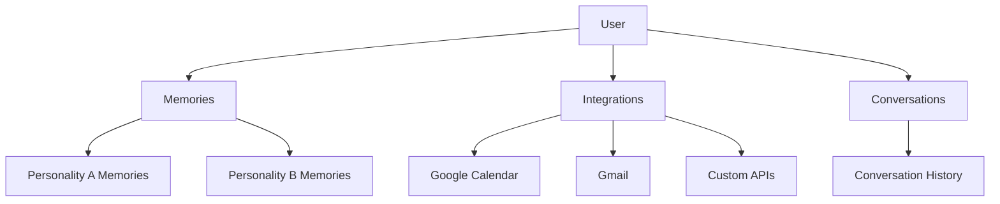

# Users

Users represent the people interacting with your AI personalities. Each user has their own memories and integrations that personalize their experience.

## User Model

```json
{
  "user_id": "user_abc123",
  "external_id": "your-user-id-456",
  "metadata": {
    "name": "Sarah",
    "email": "sarah@example.com",
    "plan": "premium"
  },
  "created_at": "2024-01-15T10:30:00Z",
  "last_conversation_at": "2024-01-20T14:22:00Z"
}
```

## Create a User

```bash
POST /users
```

```json
{
  "external_id": "your-user-id-456",
  "metadata": {
    "name": "Sarah",
    "email": "sarah@example.com"
  }
}
```

```json
{
  "user_id": "user_abc123",
  "external_id": "your-user-id-456",
  "metadata": {
    "name": "Sarah",
    "email": "sarah@example.com"
  },
  "created_at": "2024-01-15T10:30:00Z"
}
```

The `external_id` allows you to link Spike users to your own user system.

## Get a User

```bash
GET /users/:user_id
```

Or by external ID:

```bash
GET /users/external/:external_id
```

## List Users

```bash
GET /users
```

Query parameters:
- `limit` - Results per page (default: 20, max: 100)
- `cursor` - Pagination cursor
- `created_after` - Filter by creation date
- `created_before` - Filter by creation date

```json
{
  "users": [
    {
      "user_id": "user_abc123",
      "external_id": "your-user-id-456",
      "metadata": {
        "name": "Sarah"
      },
      "last_conversation_at": "2024-01-20T14:22:00Z"
    }
  ],
  "pagination": {
    "next_cursor": "eyJ...",
    "has_more": true
  }
}
```

## Update a User

```bash
PATCH /users/:user_id
```

```json
{
  "metadata": {
    "name": "Sarah",
    "plan": "enterprise"
  }
}
```

## Delete a User

```bash
DELETE /users/:user_id
```

This also deletes all memories and integration connections for the user. This action cannot be undone.

## User Data Structure



Each user has:
- **Memories** - Personal facts learned per personality
- **Integrations** - Connected external services
- **Conversations** - History of all conversations

## Memories vs Knowledge Base

| Aspect | User Memories | Knowledge Base |
|--------|---------------|----------------|
| **Scope** | Per user-personality pair | Per personality (all users) |
| **Content** | Personal facts, preferences | Documents, URLs, structured data |
| **Source** | Learned from conversations | Uploaded by developer |
| **Example** | "Sarah lives in Seattle" | "Our return policy is 30 days" |

## User Metadata

Store any custom data with your users:

```json
{
  "metadata": {
    "name": "Sarah",
    "email": "sarah@example.com",
    "plan": "premium",
    "company": "Acme Corp",
    "custom_field": "any value"
  }
}
```

Metadata is:
- Available during conversations (if enabled)
- Searchable via the API
- Useful for segmentation and analytics

## Get User Stats

```bash
GET /users/:user_id/stats
```

```json
{
  "user_id": "user_abc123",
  "stats": {
    "total_conversations": 47,
    "total_messages": 523,
    "personalities_used": 3,
    "memories_count": 28,
    "integrations_count": 2,
    "first_conversation_at": "2024-01-15T10:30:00Z",
    "last_conversation_at": "2024-01-20T14:22:00Z"
  }
}
```

## Get User Conversations

```bash
GET /users/:user_id/conversations
```

```json
{
  "conversations": [
    {
      "conversation_id": "conv_abc123",
      "personality_id": "personality_xyz",
      "status": "completed",
      "message_count": 24,
      "duration_seconds": 847,
      "created_at": "2024-01-20T14:00:00Z"
    }
  ],
  "pagination": {
    "next_cursor": "eyJ...",
    "has_more": true
  }
}
```

## Automatic User Creation

When creating conversations, you can reference users that don't exist yet:

```bash
POST /conversations
```

```json
{
  "personality_id": "personality_xyz",
  "user_id": "user_new",
  "auto_create_user": true,
  "user_metadata": {
    "name": "New User"
  }
}
```

If `user_new` doesn't exist, it will be created automatically with the provided metadata.
